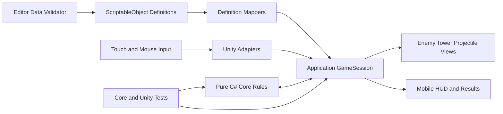
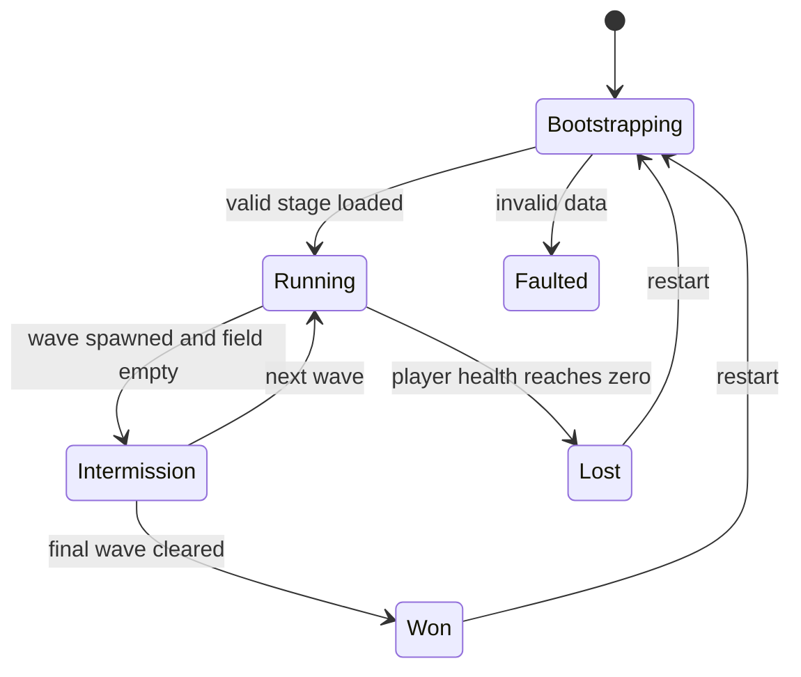

# Mobile Random Tower Defense MVP - Plan

## Goal Capsule

Android와 iOS를 같은 Unity 프로젝트에서 지원하는, 처음부터 승리 또는 패배까지 플레이 가능한 랜덤 타워 디펜스 MVP를 만든다. Linear의 ZZA-5~ZZA-16, Notion 프로젝트 문서, 저장소 문서의 공통 요구사항을 제품 계약으로 삼고, 사용자의 최신 지시인 모바일 양 플랫폼 지원과 작은 PR 단위 착륙을 우선한다.

- **권한 우선순위:** 현재 사용자 지시 > 이 계획 > `AGENTS.md` > `docs/project/` 및 외부 프로젝트 문서.
- **실행 프로필:** Unity 6.3 LTS, C#, 2D, 데이터 중심, 순수 C# Core, 얇은 Unity Adapter.
- **착륙 방식:** 구현 단위 하나를 PR 하나로 만들고, 테스트와 코드 리뷰를 통과시킨 뒤 squash merge한다. 이전 PR이 `main`에 합쳐진 뒤 다음 단위를 시작한다.
- **중단 조건:** 요구사항을 뒤집는 제품 결정이 필요하거나, GitHub/Unity 인증처럼 사용자만 해결할 수 있는 권한 문제가 생기거나, 플랫폼 빌드가 외부 하드웨어 때문에 검증 불가능한 경우에만 중단한다.
- **완료 상태:** 한 스테이지의 전체 게임 루프, 데이터 검증, 자동 테스트, Android 빌드, iOS Xcode 프로젝트 생성, 모바일 UI 검증, 플레이테스트 문서가 모두 준비되어야 한다.

---

## Product Contract

### Summary

플레이어는 짧은 모바일 세션에서 재화를 써서 빈 슬롯에 무작위 타워를 소환한다. 타워는 경로를 따라오는 적을 자동 공격한다. 적 처치로 재화를 얻고 모든 웨이브를 막으면 승리하며, 적이 종점에 도달해 체력이 0이 되면 패배한다.

### Problem Frame

현재 저장소에는 제품 문서만 있고 실행 가능한 Unity 프로젝트가 없다. MVP의 핵심 위험은 기능 수가 아니라, 랜덤 소환·자동 전투·웨이브·경제 규칙이 Scene과 Inspector에 흩어져 테스트와 반복 밸런싱이 어려워지는 것이다. 따라서 한 스테이지의 재미를 빠르게 검증하되 규칙을 순수 C#과 데이터에 드러내고, 모바일 기기에서 실제로 끝까지 플레이할 수 있는 가장 작은 수직 단면을 만든다.

### Actors

- A1. 플레이어: 소환 버튼으로 유일한 직접 전투 결정을 내리고 HUD로 상태를 확인한다.
- A2. 게임 세션: 웨이브, 적, 타워, 투사체, 경제, 승패를 결정론적으로 조율한다.
- A3. 콘텐츠 작성자: ScriptableObject 정의를 수정하고 실행 전 검증한다.

### Requirements

#### 전투 루프

- R1. 새 게임은 유효한 기본 스테이지, 플레이어 체력, 시작 재화, 빈 타워 그리드로 시작해야 한다.
- R2. 스테이지는 최소 3개 웨이브를 순서대로 실행하고, 각 웨이브는 지정된 적 수와 스폰 간격을 사용해야 한다.
- R3. 적은 고정 경로를 따라 이동하고 종점 도달 시 제거되며 플레이어에게 정의된 피해를 한 번만 줘야 한다.
- R4. 타워는 사거리 안에서 경로 진행도가 가장 높은 살아 있는 적을 안정적인 동률 규칙으로 선택하고 공격 주기에 맞춰 발사해야 한다.
- R5. 투사체는 유효한 표적까지 이동해 피해를 한 번 적용하고, 표적이 먼저 사라지면 보상이나 피해를 중복 발생시키지 않고 정리되어야 한다.
- R6. 적 체력이 0 이하가 되면 제거되고 처치 보상이 한 번 지급되어야 한다.
- R7. 모든 적 스폰과 생존 적 정리가 끝난 마지막 웨이브 뒤 승리하고, 플레이어 체력이 0이 되면 즉시 패배해야 한다.

#### 무작위 소환과 경제

- R8. 플레이어는 소환 비용 이상 재화를 보유하고 빈 슬롯이 있을 때만 소환할 수 있어야 한다.
- R9. 유효한 소환은 비용을 한 번 차감하고 빈 슬롯 하나와 소환 풀의 타워 하나를 seed 기반 난수로 선택해야 한다.
- R10. 재화 부족, 빈 슬롯 없음, 빈 소환 풀, 종료된 게임에서는 상태를 변경하지 않고 명확한 실패 이유를 반환해야 한다.
- R11. 같은 seed와 같은 명령 순서는 같은 소환 결과와 전투 결정 순서를 재현해야 한다.

#### 데이터와 검증

- R12. 적, 타워, 투사체, 웨이브, 스테이지, 경제와 보상 수치는 코드가 아니라 ScriptableObject Definition에서 제공되어야 한다.
- R13. Definition과 Runtime State를 분리하고, 참조와 저장 가능한 값에는 표시 이름이 아닌 소문자 `snake_case` ID를 사용해야 한다.
- R14. 에디터 검증은 중복 ID, 필수 참조, 음수가 될 수 없는 수치, 가중치 합계, 누락된 ID 참조를 발견해야 한다.
- R15. 저장소에는 바로 플레이 가능한 기본 스테이지와 최소 2종 타워, 2종 적, 3개 웨이브의 유효한 기본 데이터가 포함되어야 한다.

#### 모바일 경험

- R16. HUD는 현재 웨이브, 체력, 재화, 소환 비용과 가능 여부, 승리/패배 결과, 재시작 동작을 표시해야 한다.
- R17. 입력은 터치 우선 단일 탭으로 동작하고 에디터 마우스 입력에서도 동일하게 검증 가능해야 한다.
- R18. UI는 `Screen.safeArea`를 따르고 지원 모바일 해상도에서 잘리거나 겹치지 않아야 한다. 주요 버튼은 48 logical pixel 이상의 터치 영역을 갖고, 상태를 색상 하나로만 구분하지 않아야 한다.
- R19. Android는 IL2CPP와 ARM64로 빌드 가능해야 하고, iOS는 Xcode 프로젝트를 생성할 수 있어야 한다.
- R20. 앱 중단·복귀, 화면 크기 변경, 재시작에서 세션이나 UI가 중복 초기화되지 않아야 한다.

#### 품질과 협업

- R21. Core 규칙은 `UnityEngine`에 의존하지 않고 자동 단위 테스트로 경계값과 실패 경로까지 검증되어야 한다.
- R22. Unity 연결부는 EditMode/PlayMode 테스트와 에디터 실행 검증을 거치며 오류 로그가 없어야 한다.
- R23. 구현은 이해 가능한 작은 PR로 나뉘고 각 PR 본문에 범위, 검증 결과, 후속 단위를 적어야 한다.
- R24. 첫 플레이테스트 체크리스트는 세션 길이, 난이도, 무작위성 체감, 버그와 개선 의견을 별도로 수집해야 한다.

### Key Flows

- F1. **새 세션:** 앱 실행 → 기본 데이터 검증 → 전투 보드 생성 → 첫 웨이브 시작 → HUD 갱신.
- F2. **소환:** 버튼 탭 → 게임 상태·재화·빈 슬롯 확인 → 비용 차감 → seed 기반 타워·슬롯 선택 → View 생성 → HUD 갱신.
- F3. **전투 틱:** 적 이동 → 종점 처리 → 타워 표적 선택·발사 → 투사체 이동·피해 → 죽음·보상 처리 → 웨이브 완료 판단.
- F4. **종료:** 마지막 웨이브 정리 또는 체력 0 → 전투 입력 정지 → 결과 오버레이 → 재시작으로 완전한 새 세션.
- F5. **콘텐츠 편집:** Definition 변경 → `OnValidate` 및 전체 데이터 검증 → 테스트 또는 Play → 명확한 오류로 잘못된 데이터 차단.

### Acceptance Examples

- AE1. 재화 10, 비용 10, 빈 슬롯 1개일 때 소환하면 재화가 0이 되고 슬롯에 정확히 한 타워가 생긴다.
- AE2. 재화 9, 비용 10일 때 소환하면 재화와 슬롯이 그대로이고 UI는 버튼을 비활성화한다.
- AE3. 표적이 투사체 도착 전에 다른 공격으로 죽어도 처치 보상은 한 번만 지급된다.
- AE4. 한 틱에서 적이 종점에 도달하면 종점 피해와 처치 보상이 동시에 발생하지 않는다.
- AE5. 웨이브의 마지막 적이 사라진 뒤 다음 웨이브가 시작되고, 마지막 웨이브라면 승리한다.
- AE6. 같은 stage ID와 seed로 새 게임을 두 번 실행하면 최초 소환 순서가 동일하다.
- AE7. 노치가 있는 가로 화면과 좁은 모바일 화면에서 HUD와 결과 버튼이 safe area 안에 남는다.
- AE8. 결과 화면에서 재시작하면 이전 적, 타워, 투사체, 보상 구독이 남지 않고 초기 상태가 한 번 생성된다.

### Success Criteria

- 한 스테이지를 시작부터 승리 또는 패배까지 막힘 없이 반복 플레이할 수 있다.
- Core 자동 테스트, Unity EditMode/PlayMode 테스트, 데이터 검증이 모두 통과한다.
- Android 개발 빌드가 생성되고 실제 기기에서 터치, safe area, 앱 복귀를 확인한다.
- Windows에서 iOS Xcode 프로젝트를 생성하고, macOS/Xcode에서 서명 빌드할 수 있는 체크리스트를 제공한다.
- 모든 구현 PR이 개별 리뷰와 CI를 통과한 뒤 `main`에 squash merge된다.

### Scope Boundaries

포함 범위는 한 스테이지 MVP, 기본 플레이스홀더 2D 표현, 모바일 공통 입력과 UI, 기본 밸런스, 데이터 검증, 테스트, 빌드 설정, 첫 플레이테스트 문서다. 튜토리얼, 계정·클라우드 저장, 광고, 인앱 결제, 영구 성장, 타워 합성·희귀도, 유물·룬, 최종 아트·오디오, Steam 배포는 후속 범위다.

### Dependencies

- Unity Editor 6000.3.20f1 및 Android Build Support가 필요하다.
- iOS 네이티브 서명·실기기 검증은 macOS, Xcode, Apple 개발자 서명 환경이 필요하다.
- GitHub PR 생성과 merge 권한이 필요하며 현재 저장소는 squash merge를 지원한다.

### Sources

- `AGENTS.md`
- `docs/project/one-pager.md`
- `docs/project/mvp-scope.md`
- `docs/project/roadmap.md`
- `docs/engineering/unity-architecture.md`
- `docs/ops/workflow.md`
- Linear ZZA-5~ZZA-16 및 연결 문서
- Notion 랜덤 타워 디펜스 프로젝트 허브와 Unity 결정 문서
- [Unity 6 release support](https://unity.com/releases/unity-6)
- [Unity Screen.safeArea](https://docs.unity3d.com/ScriptReference/Screen-safeArea.html)
- [Unity Android Player settings](https://docs.unity3d.com/Manual/class-PlayerSettingsAndroid.html)

---

## Planning Contract

### Key Technical Decisions

- KTD1. Unity 버전은 계획 시점 최신 6.3 LTS 패치인 `6000.3.20f1`로 고정한다. 프로젝트 버전과 패키지 lock을 커밋하고 기능 PR에서 엔진 업그레이드를 섞지 않는다.
- KTD2. Core는 `Assets/_Project/Scripts/Core`의 순수 C#으로 만들고 Application이 이를 조율하며 UnityAdapters와 Presentation은 Scene, 입력, View, HUD만 연결한다.
- KTD3. Core 시간은 명시적 `deltaTime`, 난수는 주입된 seed 기반 `IRandomSource`로 처리한다. Unity의 전역 `Time`과 `Random`을 Core에서 호출하지 않는다.
- KTD4. 전투는 한 프레임에서 이동·종점 → 공격 예약 → 투사체·피해 → 죽음·보상 → 웨이브·종료 판정 순서를 고정한다. 이 순서가 종점 피해와 보상 중복을 막는다.
- KTD5. 기본 화면 방향은 가로이며 좌우 가로 회전을 허용한다. 타워 보드와 HUD의 가독성을 유지하면서 safe area와 다양한 종횡비에 대응한다.
- KTD6. Unity 라이선스가 없는 GitHub CI에서도 Core를 검증할 수 있도록 별도 .NET 테스트 프로젝트가 같은 Core 소스를 컴파일한다. Unity Test Framework는 EditMode와 PlayMode 연결 검증을 담당한다.
- KTD7. Scene과 기본 ScriptableObject는 에디터 생성 도구로 만들고 생성 결과를 커밋한다. 수동으로 대량 Unity YAML을 작성하지 않는다.
- KTD8. 계획 문서를 먼저 독립 PR로 착륙시키고 각 U-ID를 하나의 작은 PR에 대응한다. 각 PR은 최신 `main`에서 `codex/<linear-id>-<slug>` 브랜치를 만들고 자체 리뷰·CI 후 squash merge하며 다음 PR은 합쳐진 `main`에서 시작한다. (session-settled: user-directed — chosen over one large implementation PR: the user needs each change to remain understandable)
- KTD9. 런타임 UI는 모바일에서 검증이 성숙한 uGUI를 사용하고, 입력은 Unity Input System의 UI 모듈로 터치와 마우스를 같은 명령 경계에 연결한다. 별도 UI 프레임워크나 입력 추상화 계층은 만들지 않는다.
- KTD10. 앱이 background 또는 focus-loss 상태면 Application tick을 멈추고 복귀 시 같은 상태에서 재개한다. 경과 시간을 따라잡는 offline simulation은 하지 않는다.

### Assumptions

- 화면 방향은 기존 문서에서 미정이므로 타워 디펜스 보드 가독성이 높은 가로를 기본으로 선택한다.
- 최종 아트가 범위 밖이므로 코드 또는 단순 프로젝트 에셋으로 만든 명확한 기하학적 플레이스홀더를 사용한다.
- 하나의 로컬 플레이 세션만 지원하고 저장/로드나 오프라인 진행은 구현하지 않는다.
- 사용자가 PR 생성·리뷰·머지를 요청했으므로 외부 Linear/Notion 상태는 바꾸지 않고 GitHub 코드 흐름만 진행한다.
- iOS Xcode 프로젝트 생성까지는 Windows에서 검증하되, 서명된 앱과 실기기 확인은 macOS 체크리스트의 외부 검증 항목으로 남긴다.

### High-Level Technical Design

아래 설계는 책임과 데이터 흐름을 고정하는 개념도이며 클래스나 메서드의 정확한 형태를 규정하지 않는다.





### Output Structure

```text
Assets/_Project/
  Scripts/
    Core/{Combat,Towers,Enemies,Waves,Economy,Random}/
    Application/{Systems,UseCases}/
    UnityAdapters/{MonoBehaviours,Installers,Views}/
    Presentation/UI/
    Data/{Definitions,Runtime}/
    Editor/
  Tests/{EditMode,PlayMode}/
  Data/{Towers,Enemies,Projectiles,Waves,Stages,Economy}/
  Scenes/
Tests/RandomTowerDefense.Core.Tests/
docs/playtesting/
.github/workflows/
```

### Sequencing

프로젝트 기반을 먼저 고정하고 Core 규칙을 두 PR로 나눈다. 이후 데이터와 변환 경계를 넣고, 런타임 보드와 공격을 별도 PR로 연결한다. 마지막에 HUD와 플랫폼 설정을 붙인 뒤 전체 릴리스 검증만 다루는 작은 수정 PR로 닫는다. 각 단계의 `main`이 항상 빌드 가능한 상태여야 한다.

### System-Wide Impact

- **상태 수명주기:** composition root 하나가 세션과 View registry를 소유한다. restart와 Scene unload는 구독, 적, 타워, 투사체를 모두 해제한 뒤 새 세션을 한 번 만든다.
- **이벤트 경계:** Core는 Unity 객체 대신 값 기반 이벤트를 내보낸다. Application은 순서를 보존해 View와 HUD에 전달하고, View 제거 실패가 Core 보상이나 승패 판정을 되돌리지 않는다.
- **실패 전파:** 데이터 검증 실패는 전투 시작을 막고 정의 ID와 필드가 포함된 명확한 오류를 남긴다. 명령 거부는 예외 대신 결과 값으로 UI까지 전달한다.
- **성능:** MVP 규모에서는 tick마다 전체 활성 적을 순회할 수 있다. pooling이나 공간 분할은 프로파일링 증거가 생길 때만 추가한다.
- **플랫폼 차이:** Core와 콘텐츠는 공유한다. Android/iOS 차이는 Player Settings, build pipeline, safe area와 앱 수명주기 Adapter에만 제한한다.

---

## Implementation Units

### U1. Unity 모바일 프로젝트 기반

- **PR:** `codex/zza-5-mobile-foundation`.
- **Goal:** Unity 6.3 프로젝트가 Android/iOS 모듈을 고려한 텍스트 직렬화, 폴더, asmdef, 테스트, CI 뼈대를 갖춘다.
- **Requirements:** R19, R21, R23.
- **Files:** `ProjectSettings/`, `Packages/`, `Assets/_Project/Scripts/`, `Assets/_Project/Tests/`, `Tests/RandomTowerDefense.Core.Tests/`, `scripts/`, `.github/workflows/core-tests.yml`, `.gitignore`, `.gitattributes` 및 대응 `.meta`.
- **Approach:** Unity Editor로 프로젝트와 lock 파일을 생성하고 레이어별 assembly boundary를 만든다. Core source를 컴파일하는 .NET 테스트 harness와 GitHub CI를 추가하며, Unity가 생성한 프로젝트 파일은 계속 무시하되 `Tests/RandomTowerDefense.Core.Tests/*.csproj`만 `.gitignore` 예외로 추적한다.
- **Test Scenarios:** Unity가 프로젝트를 경고 없이 열고 빈 EditMode 테스트를 검색한다. `dotnet test`가 CI와 로컬에서 성공한다. Android/iOS build target이 설치된 모듈로 선택 가능하다.
- **Verification:** 프로젝트 버전, package lock, Force Text, Visible Meta Files, 플랫폼 설정, 모든 `.meta` 추적 여부를 확인한다.
- **Dependencies:** 없음.

### U2a. 적·경로·피해·표적 선택 Core

- **PR:** `codex/zza-7-enemy-targeting-core`.
- **Goal:** Unity 없이 적 이동, 피해, 죽음과 표적 우선순위를 결정론적으로 계산한다.
- **Requirements:** R3, R4의 표적 선택, R6, R21; AE4.
- **Files:** `Assets/_Project/Scripts/Core/{Combat,Enemies,Towers}/`, `Assets/_Project/Tests/EditMode/Core/`, `Tests/RandomTowerDefense.Core.Tests/`.
- **Approach:** Definition snapshot과 mutable runtime state를 분리한다. 적 진행도와 spawn order로 표적 우선순위를 정하고 idempotent death/endpoint transition을 둔다.
- **Test Scenarios:** 여러 delta step에서도 경로 끝 도달이 한 번만 발생한다. 사거리 경계와 동률 표적이 안정적이다. 죽은 적에 대한 중복 피해가 보상을 만들지 않는다.
- **Verification:** Core assembly에서 `UnityEngine` 참조가 없고 단위 테스트가 정상·경계·실패 경로를 모두 통과한다.
- **Dependencies:** U1.

### U2b. 타워 공격 주기·투사체 Core

- **PR:** `codex/zza-7-tower-projectile-core`.
- **Goal:** 타워 공격 주기와 투사체 이동·피해를 Unity 없이 계산한다.
- **Requirements:** R4의 공격 주기, R5, R11, R21; AE3.
- **Files:** `Assets/_Project/Scripts/Core/{Combat,Towers,Random}/`와 관련 Core 테스트.
- **Approach:** 타워는 명시적 cooldown과 안정적인 공격 순서를 사용하고, 투사체는 한 번만 적중하거나 표적 소실로 정리되는 상태 전이를 갖는다.
- **Test Scenarios:** 공격 주기 경계, 투사체 적중, 표적 선행 사망, 중복 tick, 동일 입력 순서의 결정론을 검증한다.
- **Verification:** 투사체 피해와 kill reward가 중복되지 않고 Core 테스트가 통과한다.
- **Dependencies:** U2a.

### U3a1. 결정론적 난수·재화 Core

- **PR:** `codex/zza-10-random-economy-core`.
- **Goal:** 런타임 버전에 독립적인 seed 난수와 안전한 재화 증감 원시 규칙을 제공한다.
- **Requirements:** R8, R9, R11, R21; AE6.
- **Files:** `Assets/_Project/Scripts/Core/{Random,Economy}/`와 관련 Core 테스트.
- **Approach:** 고정 알고리즘의 `IRandomSource` 구현과 overflow를 차단하는 `EconomyState`를 둔다.
- **Test Scenarios:** seed별 고정 수열, 범위 경계, 재화 부족, 잘못된 금액, overflow를 검증한다.
- **Verification:** 같은 seed가 고정된 기대 수열을 만들고 재화 불변식이 유지된다.
- **Dependencies:** U2b.

### U3a2. 무작위 타워·슬롯 소환 Core

- **PR:** `codex/zza-10-summon-grid-core`.
- **Goal:** seed 기반 타워·빈 슬롯 선택과 원자적 비용 차감/배치를 완성한다.
- **Requirements:** R8~R11, R21; AE1, AE2, AE6.
- **Files:** `Assets/_Project/Scripts/Core/Towers/`와 관련 Core 테스트.
- **Approach:** 명시적 소환 실패 결과를 사용하고, 실패 명령은 재화, 슬롯, 난수 상태를 바꾸지 않는다.
- **Test Scenarios:** 정상 소환, 재화 부족, 빈 슬롯 없음, 빈 소환 풀, 종료 후 소환, 가중치 선택, seed 재현성을 검증한다.
- **Verification:** 같은 seed와 명령 순서가 같은 타워·슬롯 결과를 만들고 모든 실패 경로가 원자적이다.
- **Dependencies:** U3a1.

### U3b. 웨이브 진행 Core

- **PR:** `codex/zza-8-wave-core`.
- **Goal:** 적 스폰 간격, 웨이브 전환, 마지막 웨이브 정리를 Unity 없이 계산한다.
- **Requirements:** R2, R7, R11, R21; AE5.
- **Files:** `Assets/_Project/Scripts/Core/Waves/`와 관련 Core 테스트.
- **Approach:** 웨이브 Definition과 mutable progress를 분리하고, spawn/completion 이벤트를 명시적 결과로 반환한다.
- **Test Scenarios:** 3개 웨이브 스폰 순서, 간격 경계, 생존 적 대기, 마지막 웨이브 완료를 검증한다.
- **Verification:** 여러 delta step과 동일 입력에서 같은 스폰·전환 순서가 재현된다.
- **Dependencies:** U3a2.

### U3c1. 적·웨이브·체력 수명주기 Core

- **PR:** `codex/zza-8-enemy-wave-session-core`.
- **Goal:** 웨이브 spawn 요청을 적 runtime으로 만들고 이동·종점 피해·승패·재시작 수명주기를 완성한다.
- **Requirements:** R1~R3, R6, R7, R11, R20, R21; AE4, AE5, AE8.
- **Files:** `Assets/_Project/Scripts/Core/{Enemies,Waves,Combat}/`와 관련 Core 테스트.
- **Approach:** 이동/종점, 죽은 적 정리, 웨이브 spawn을 명시적 phase API와 immutable 결과로 나눠 이후 전투 조율 순서를 고정할 수 있게 한다.
- **Test Scenarios:** 종점 피해 한 번, 체력 0 패배, 죽은 적 보상 정리 한 번, 승리, spawn order, restart 초기화를 검증한다.
- **Verification:** 적/웨이브/체력 상태가 phase 경계를 넘어 중복 처리되지 않고 자동 테스트가 통과한다.
- **Dependencies:** U3b.

### U3c2. 전투·경제 게임 세션 조율 Core

- **PR:** `codex/zza-8-game-session-core`.
- **Goal:** 소환, 이동·종점, 공격 예약, 투사체·피해, 보상, 웨이브·승패와 완전한 재시작을 하나의 세션 명령 경계로 조율한다.
- **Requirements:** R1, R3~R11, R20, R21; AE1~AE6, AE8.
- **Files:** `Assets/_Project/Scripts/Core/{Combat,Waves,Economy,Towers}/`와 관련 Core 테스트.
- **Approach:** 기존 phase와 시스템을 고정 순서로 호출하고 한 틱의 immutable 결과 이벤트를 수집한다.
- **Test Scenarios:** 전투 순서, kill reward, 종점/보상 상호 배제, 종료 후 명령, seed 재현, restart 초기화를 검증한다.
- **Verification:** 전체 세션 상태 전이와 경제 불변식이 자동 테스트로 증명되고 CI에서 통과한다.
- **Dependencies:** U3c1.

### U4a. ScriptableObject 데이터 스키마·Core mapper

- **PR:** `codex/zza-12-data-schema`.
- **Goal:** 적, 투사체, 타워, 웨이브, 경제, 스테이지를 Unity 직렬화 데이터로 표현하고 Core 세션 Definition으로 변환한다.
- **Requirements:** R12, R13, R21; F5.
- **Files:** `Assets/_Project/Scripts/Data/{Definitions,Runtime}/`와 관련 EditMode 테스트.
- **Approach:** 에셋 참조와 Unity `Vector2`는 mapper 경계에서 ID 기반 순수 C# snapshot으로 변환한다.
- **Test Scenarios:** 완전한 3-wave stage 변환과 누락된 필수 참조 오류를 검증한다.
- **Verification:** 변환 결과로 `GameSession`을 생성·시작할 수 있고 Data 외부 Core에는 Unity 참조가 없다.
- **Dependencies:** U3c2.

### U4b. 데이터셋 validator

- **PR:** `codex/zza-12-data-validator`.
- **Goal:** 잘못된 Definition을 실행 전 한 번에 발견하고 개별 `OnValidate`와 메뉴 검증에서 같은 오류를 보고한다.
- **Requirements:** R13, R14, R21; F5.
- **Files:** `Assets/_Project/Scripts/Data/Validation/`, `Assets/_Project/Scripts/Editor/`, 관련 EditMode 테스트.
- **Approach:** ID, 필수 참조, 수치 범위, 가중치 합, path, 최소 콘텐츠와 중복 참조를 순수 결과 목록으로 검사한다.
- **Test Scenarios:** 빈/중복 ID, 음수 수치, 0 이하/overflow 가중치, 누락 참조, 잘못된 path가 실패한다.
- **Verification:** mapper 전에 validator가 모든 오류를 수집하고 유효 데이터에는 오류가 없다.
- **Dependencies:** U4a.

### U4c. 기본 콘텐츠 에셋·플레이테스트 문서

- **PR:** `codex/zza-12-default-content`.
- **Goal:** 바로 플레이 가능한 2종 타워, 2종 적, 3-wave 스테이지와 첫 플레이테스트 체크리스트를 제공한다.
- **Requirements:** R15, R24; F5.
- **Files:** `Assets/_Project/Data/`, editor generator, `docs/playtesting/first-playtest.md`, 관련 EditMode 테스트.
- **Approach:** Unity Editor generator로 텍스트 직렬화 에셋을 생성하고 수동 대량 YAML 편집을 피한다.
- **Test Scenarios:** 기본 dataset의 존재, 최소 콘텐츠 수, validator 통과와 Core 변환을 검증한다.
- **Verification:** generator 재실행이 idempotent하고 기본 stage가 `GameSession`을 시작한다.
- **Dependencies:** U4b.

### U5. 웨이브와 적의 플레이 가능한 보드

- **PR:** `codex/zza-8-wave-board`.
- **Goal:** 실제 Unity Scene에서 새 세션, 카메라, 경로, 적 스폰·이동·종점 피해, 웨이브 진행을 볼 수 있다.
- **Requirements:** R1~R3, R7, R17, R20; F1, F3, F4.
- **Files:** `Assets/_Project/Scripts/Application/`, `Assets/_Project/Scripts/UnityAdapters/{Installers,Views}/`, `Assets/_Project/Scenes/Main.unity`, 관련 prefab과 PlayMode 테스트.
- **Approach:** 한 bootstrap composition root가 데이터, clock, random, GameSession을 조립한다. MonoBehaviour는 tick과 이벤트를 전달하고 View 수명만 관리한다.
- **Test Scenarios:** Scene 시작 시 첫 웨이브가 한 번 생성된다. 적이 경로를 따라 이동하고 종점에서 체력이 감소한다. 재시작과 Scene reload가 중복 listener를 만들지 않는다.
- **Verification:** PlayMode 테스트와 에디터 실행에서 3개 웨이브·승패 상태까지 console error 없이 진행된다.
- **Dependencies:** U4c.

### U6. 타워 소환·자동 공격·투사체 연결

- **PR:** `codex/zza-10-tower-combat`.
- **Goal:** 플레이어 소환부터 자동 표적·발사·피해·처치 보상까지 화면에서 완전한 전투 루프가 동작한다.
- **Requirements:** R4~R11, R15, R17; F2, F3; AE1~AE6.
- **Files:** `Assets/_Project/Scripts/Application/`, `Assets/_Project/Scripts/UnityAdapters/Views/`, 타워·투사체 prefab, PlayMode 테스트.
- **Approach:** Core 이벤트를 타워/투사체 View에 투영하고, View가 규칙을 소유하지 않게 한다. 소환 명령 결과로 슬롯과 재화를 원자적으로 갱신한다.
- **Test Scenarios:** 탭 한 번에 한 타워만 생긴다. 재화 부족과 full grid에서 생성되지 않는다. 적이 먼저 죽은 투사체가 안전하게 사라진다. 처치 보상이 HUD 모델에 한 번 반영된다.
- **Verification:** 기본 seed 플레이에서 소환 결과가 재현되고, 화면 상태와 Core snapshot이 일치한다.
- **Dependencies:** U5.

### U7. 모바일 HUD와 결과 경험

- **PR:** `codex/zza-13-mobile-hud`.
- **Goal:** 모바일 가로 화면에서 전투 정보를 읽고 소환·재시작할 수 있으며 safe area와 앱 수명주기를 처리한다.
- **Requirements:** R16~R18, R20; AE2, AE7, AE8.
- **Files:** `Assets/_Project/Scripts/Presentation/UI/`, HUD prefab, Scene Canvas, PlayMode 테스트.
- **Approach:** 전투 보드가 화면 중앙의 주 영역을 차지하고, safe area 안의 상단 status strip에 wave·health·currency를, 하단 action area에 큰 summon 버튼을 둔다. HUD는 읽기 전용 presentation model을 구독한다. safe area adapter는 화면·방향 변화 때만 layout을 다시 적용하고 버튼 상태를 텍스트·형태·interactable 속성으로 함께 표현한다.
- **Test Scenarios:** 대표 16:9, 19.5:9, 4:3 safe area에서 HUD가 경계 안에 있다. 결과 오버레이가 입력을 막고 재시작이 초기 UI를 복원한다. 앱 pause/resume이 중복 tick을 만들지 않는다.
- **Verification:** Device Simulator와 PlayMode 테스트에서 텍스트, 버튼, 결과 화면, safe area가 정상이며 console error가 없다.
- **Dependencies:** U6.

### U8. Android/iOS 빌드와 MVP 완료 검증

- **PR:** `codex/zza-14-mobile-release`.
- **Goal:** 모바일 빌드 설정, 자동 build validation, 문서와 전체 회귀를 마치고 MVP를 배포 가능한 상태로 만든다.
- **Requirements:** R19, R22~R24.
- **Files:** `ProjectSettings/`, `Assets/_Project/Scripts/Editor/Build/`, `scripts/`, `docs/ops/`, `docs/playtesting/`, `README.md`, 필요 시 테스트·버그 수정 파일.
- **Approach:** Android IL2CPP/ARM64와 iOS build target을 명시적으로 검증하는 editor build script를 제공한다. 설치 가능한 산출물은 Git에 넣지 않고 검증 결과만 PR에 기록한다.
- **Test Scenarios:** clean checkout에서 Core, EditMode, PlayMode, data validation, Android development build, iOS Xcode project export가 성공한다. 실제 Android에서 터치·safe area·pause/resume·승패·restart 체크리스트를 통과한다.
- **Verification:** 전체 검증 매트릭스가 통과하고 미검증 iOS 서명 단계는 macOS 실행 절차와 함께 명확히 기록된다.
- **Dependencies:** U7.

---

## Verification Contract

각 PR은 해당 U-ID의 테스트만으로 끝내지 않고 이전 단위의 빠른 회귀 검증도 수행한다.

- **텍스트/저장소:** `git diff --check`, `.meta` 누락 검사, 추적 금지 디렉터리와 빌드 산출물 부재 확인.
- **Core:** `dotnet test Tests/RandomTowerDefense.Core.Tests/RandomTowerDefense.Core.Tests.csproj --configuration Release`.
- **Unity EditMode:** `powershell -File scripts/Invoke-Unity.ps1 -Task EditMode`가 결과 XML을 생성하고 실패·error log 없이 끝나야 한다.
- **Unity PlayMode:** `powershell -File scripts/Invoke-Unity.ps1 -Task PlayMode`가 `Main` Scene 검증을 통과하고 unexpected log 없이 끝나야 한다.
- **데이터:** `powershell -File scripts/Invoke-Unity.ps1 -Task ValidateData`가 기본 dataset 오류 0개를 보고해야 한다.
- **Android:** `powershell -File scripts/Invoke-Unity.ps1 -Task BuildAndroid`가 IL2CPP/ARM64 development build를 로컬 검증 디렉터리에 생성해야 한다.
- **iOS:** `powershell -File scripts/Invoke-Unity.ps1 -Task ExportIos`가 Xcode project를 생성해야 한다. 서명 archive와 실기기 실행은 macOS/Xcode 체크리스트로 검증한다.
- **PR gate:** 자체 코드 리뷰의 P0/P1 발견을 수정하고, GitHub checks가 green인 뒤 squash merge한다.

---

## Definition of Done

- R1~R24와 AE1~AE8이 구현 또는 검증 증거에 추적된다.
- 계획 문서 PR과 U1~U8의 구현 PR이 각각 리뷰되고 순서대로 `main`에 squash merge된다.
- `main`에서 Core, EditMode, PlayMode, 데이터 검증, Android build, iOS export가 통과한다.
- Android 실기기 체크리스트가 완료되고 iOS 서명 검증의 환경 의존성이 문서화된다.
- 기본 스테이지가 시작, 소환, 자동 전투, 3개 웨이브, 승리/패배, 재시작을 console error 없이 반복한다.
- 핵심 규칙은 UnityEngine에 의존하지 않고 밸런스 값은 Definition에만 존재한다.
- Unity 생성 임시 폴더와 빌드 산출물이 Git에 포함되지 않고 모든 필요한 `.meta`가 포함된다.
- 실패한 실험, 임시 debug 코드, 사용하지 않는 에셋과 TODO가 최종 diff에 남지 않는다.
- README, 빌드 절차, 플레이테스트 체크리스트가 현재 구현과 일치한다.

---

## Risks & Dependencies

- **Unity 설치 크기와 시간:** 첫 PR 전에 정확한 Editor와 Android/iOS 모듈을 설치하고 버전을 고정한다. 설치가 오래 걸려도 코드 버전을 임의로 낮추지 않는다.
- **GitHub CI의 Unity 라이선스:** Core CI는 라이선스 없이 실행한다. Unity batchmode 검증은 로컬에서 증거를 남기고, 라이선스 secret이 없으면 Unity CI 도입을 완료 조건으로 강제하지 않는다.
- **iOS 서명 환경:** Windows는 Xcode export까지만 보장한다. macOS가 제공되면 마지막 검증을 실행하고, 없으면 미검증 상태를 숨기지 않는다.
- **수동 Unity YAML 손상:** Scene과 데이터는 editor generator로 생성하고 작은 diff로 리뷰한다. 생성 후 Unity reserialize와 실행 테스트를 통과시킨다.
- **PR 연쇄 의존성:** 한 PR이 merge되지 않으면 다음 PR을 시작하지 않는다. base movement로 인한 이해도 저하와 대형 누적 diff를 막는다.
- **플레이 밸런스 불확실성:** 수치는 데이터로 격리하고 첫 플레이테스트 결과는 후속 밸런스 PR로 처리한다. MVP 구조를 밸런스 조정과 섞지 않는다.
